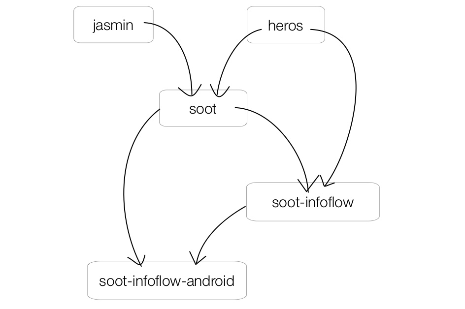
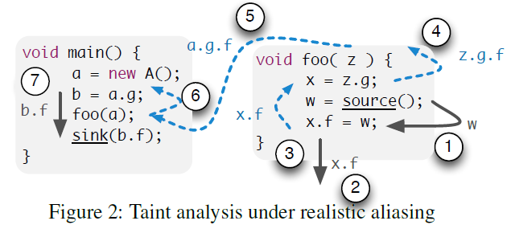

<details open><!-- 可选open -->
<summary>Contents</summary>
<div markdown="1">
* list
{:toc}
</div>
</details>

## FlowDroid

### 代码结构

’14论文[主页](https://blogs.uni-paderborn.de/sse/tools/flowdroid/)-源码分为两部分：

- soot-infoflow：通用的污点分析
- soot-infoflow-android：建模安卓组件生命周期等

依赖Soot和Heros：

* [Soot](https://sable.github.io/soot)：起初是Java优化框架，现常被用于Java和安卓应用的分析、插桩、优化、可视化等（Call-graph construction, Def/use chain...）
* [Heros](https://sable.github.io/heros) - IFDS框架：将函数间的数据流分析问题转化为图可达问题

<!--more-->

<p style="text-align:center"></p>

### context-, flow-, field- and object-sensitive

#### 数据流分析的分类（General）
* 程序路径分析的精度
	* 流不敏感分析（flow insensitive）：程序路径的物理位置从上往下
	* 流敏感分析（**flow** sensitive）：考虑语句可能的执行顺序（常要利用CFG）
	* 路径敏感分析（path sensitive）：不仅考虑语句的先后顺序，还对程序执行路径条件加以判断
* 程序路径分析的深度
	* 过程内分析（intra-procedure）：只针对函数内部的代码。`CFG`
	* 过程间分析（inter-procedure）：考虑函数之间的数据流，即需跟踪分析目标数据在函数之间的传递过程。`Call Graph`, `ICFG`
		* 上下文不敏感（context-insensitive）：将每个调用或返回看作一个’goto‘，忽略调用位置和函数参数取值等函数调用的相关信息
		* 上下文敏感（**context**-sensitive）：对不同调用位置调用的同一函数加以区分

#### object-sensitive

面向对象的编程语言，如Java：contain aliasing and virtual dispatch constructs。安卓往往包含更深的aliasing（别名）relationships.

<p style="text-align:center"></pp>


#### field-sensitive

关乎敏感信息的来源。例：用户对象包含了用户名和密码两个字段，分析时只有后者应被视作private value。对于用户界面上返回该字段内容的API，还需要结合manifest和layout的XML文件中的附加信息。

## 用Maven构建Flowdroid

1. 下载`apache-maven-3.6.3.zip`并解压，将其下`bin`文件的路径添加到环境变量。
2. git clone到本地后，使用命令`mvn -DskipTests install`
3. 编译好的jar包在`soot-infoflow`和`soot-infoflow-android`下的`target`目录下。其中`apidocs`是Javadoc根据代码里的注释规范生成的（宝藏！）。

### 主要问题和解决方法

- Maven下载过慢：apache-maven-3.6.3\conf\settings.xml下配置镜像。阿里云的很快。我的镜像配置长下面这样，放在mirrors标签中。

  ```xml
    <mirror>
        <id>nexus-aliyun</id>
        <name>Nexus aliyun</name>
        <url>http://maven.aliyun.com/nexus/content/groups/public/</url>
        <mirrorOf>central</mirrorOf>
    </mirror>
    <!-- 中央仓库1 -->
    <mirror>
        <id>repo1</id>
        <mirrorOf>central</mirrorOf>
        <name>Human Readable Name for this Mirror.</name>
        <url>http://repo1.maven.org/maven2/</url>
    </mirror>
    <!-- 中央仓库2 -->
    <mirror>
        <id>repo2</id>
        <mirrorOf>central</mirrorOf>
        <name>Human Readable Name for this Mirror.</name>
        <url>http://repo2.maven.org/maven2/</url>
    </mirror>
  ```

- 有的jar包仍然下载很慢甚至失败。参考下节的方法先下载jar包到本地再Maven安装。

- 出现以下信息，大概是说失败记录缓存在本地了，在一段时间里都不会重试。可以直接在命令后加`-U`，或者是在settings.xml中修改[**updatePolicy**](https://stackoverflow.com/questions/4856307/when-maven-says-resolution-will-not-be-reattempted-until-the-update-interval-of)。

  ```shell
  xxx was cached in the local repository, resolution will not be reattempted until the update interval of xx has elapsed or updates are forced -> [Help 1]
  ```

- 构建soot-infoflow-android时出的错，`pom.xml`中AXMLPrinter的repository地址好像访问不了了，挂梯子也不行。这个包的主要作用是对Android的二进制格式的Androidmanifest.xml进行解析。

  我到开头说的那个搜索jar包的网上找dependency中对应的版本，有一个artifactId是AXMLPrinter2的repository，但下载链接也是无效的，感觉是很早的工具可能很久没维护了。

  最后我用的是com.android的AXMLPrinter的1.0.0，然后把repository的url修改一下。在FlowDroid项目的issues里自问自答了一下...[见下](https://github.com/secure-software-engineering/FlowDroid/issues/237)...

  > I did the following two steps, and it worked for me.
  >
  > - use the jar file [here](https://mvnrepository.com/artifact/com.android/AXMLPrinter/1.0.0), and modify the `dependency`:
  >
  > ```xml
  > <dependency>
  > 	<groupId>com.google.protobuf</groupId>
  > 	<artifactId>protobuf-java</artifactId>
  > 	<version>3.4.0</version>
  > </dependency>
  > ```
  >
  >
  > - modify the `repositories` like this:
  >
  > ```xml
  > <repositories>
  > 	<repository>
  > 		<id>soot-snapshot</id>
  > 		<name>Soot snapshot server</name>
  > 		<url>http://dev.91xmy.com/nexus/content/repositories/releases/</url>
  > 	</repository>
  > 	<!-- <repository>
  > 		<id>soot-release</id>
  > 		<name>Soot release server</name>
  > 		<url>https://soot-build.cs.uni-paderborn.de/nexus/repository/soot-release/</url>
  > 	</repository> -->
  > </repositories>
  > ```
  >
  > Build Success. Hope there would be no problems in the future.😄

### [Maven 手动添加 JAR 包到本地仓库](http://www.blogjava.net/fancydeepin/archive/2012/06/12/maven3-install-jar.html)

> [MVNRepository](http://mvnrepository.com/) 搜索可用的 JAR 包信息并下载

以spring-context-support为例，pom.xml中可用的Maven信息如下。

```xml
<dependency>
    <groupId>org.springframework</groupId>
    <artifactId>spring-context-support</artifactId>
    <version>3.1.0.RELEASE</version>
</dependency>
```

Maven安装本地jar包命令：**`mvn install:install-file -Dfile=jar包的位置 -DgroupId=groupId -DartifactId=artifactId -Dversion=version -Dpackaging=jar`**。用上面的例子即

```shell
mvn install:install-file -Dfile=spring-context-support-3.1.0.RELEASE.jar -DgroupId=org.springframework -DartifactId=spring-context-support -Dversion=3.1.0.RELEASE -Dpackaging=jar
```

## 使用jar包运行Flowdroid

若不需要修改源码，推荐此方式：只要在[Release页面](https://github.com/secure-software-engineering/FlowDroid/releases)下载`soot-infoflow-cmd-jar-with-dependencies.jar`即可。使用的示例可参考：https://github.com/hao-fu/MyFlowAnalysis

> *在soot中，函数的signature就是由该函数的类名，函数名，参数类型，以及返回值类型组成的字符串*
