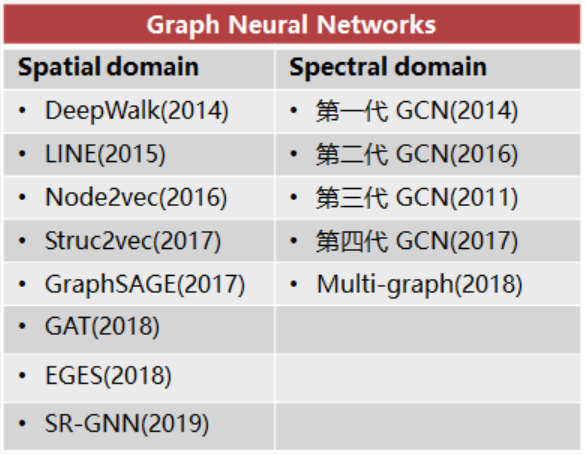
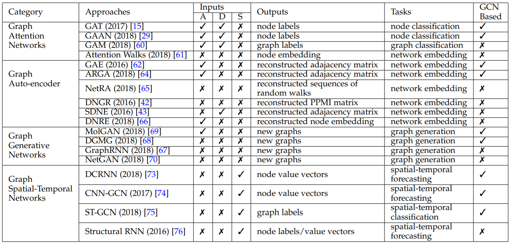
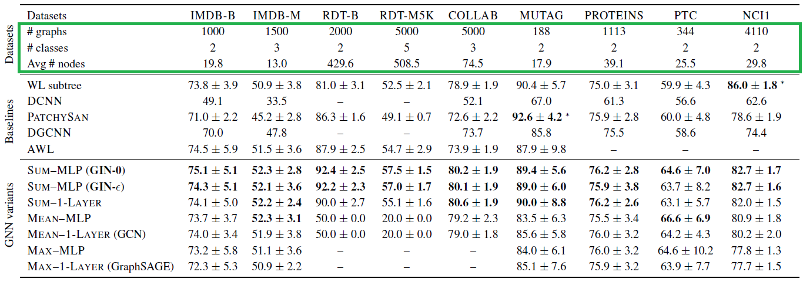

<!-- 可选open -->

Contents

<!-- TOC -->

- [图表示学习](#图表示学习)
    - [图卷积神经网络GCN](#图卷积神经网络gcn)
        - [基本模型](#基本模型)
        - [更新的模型](#更新的模型)
- [常用数据集](#常用数据集)

<!-- /TOC -->

## 图表示学习

传统的Graph Mining是人工定义各种Metric，如出入度。 

图表示学习通过学习映射，来获得节点在低维向量空间的表示。演变过程：

- 图结构信息：邻居节点
- 基于随机游走的邻居序列
  - 转化为Word2Vec：每个随机游走路径被当作Word2Vec中的一个句子，每个节点则是Word2Vec中的一个词。如DeepWalk，Node2Vec，Metapath2Vec（异构图）
  - DeepWalk第一次将深度学习中的技术引入到图表示学习领域
- 基于局部子图的邻居：图神经网络
  - 通过用**谱图理论**或**空间局部性**重新定义**图卷积**

### 图神经网络

#### 图卷积神经网络GCN

卷积的本质：加权求和，只是组合了加和乘法一种复杂一点的运算。 
<!--more-->

GCN是CNN的推广：CNN处理的图像或者视频数据中像素点（pixel）是排列成成很整齐的矩阵，在Non Euclidean Structure的数据上无法保持平移不变性。拓扑连接是一种更广义的数据结构，GCN理论的很大一部分工作就是为了给这种数据结构引入可优化的卷积参数。 

GCN 方法分为两类，分别基于谱和空间。GCN也特指频域上做卷积的图卷积神经网络，我之前很长一段时间都会被弄迷糊:cry:。为了区别，下文我注释了spectal，是一般论文里用的Baseline。事实上如GraphSAGE等都是在做卷积，同传统CNN一样在空域上。 

[为什么CNN不用FFT做卷积？](https://www.zhihu.com/question/264307400)我查到的说法是：傅里叶变换只有在卷积核比较大的时候才有明显速度优势。

#### 基本模型

- GCN（spectral）	`直推式(transductive)学习`

  - 2017（第四代）：[Semi-Supervised Classification with Graph Convolutional Networks](https://arxiv.org/abs/1609.02907)

  - 利用**图Laplacian矩阵**做**傅里叶变换**，将**卷积**放到**频域**求解。[如何理解](https://www.zhihu.com/question/54504471)

    > 核心工作是把拉普拉斯算子的特征函数 $$e^{-iwt}$$ 变为Graph对应的拉普拉斯矩阵的特征向量

- GraphSAGE, NIPS 2017 `归纳(inductive)学习`

  - PinSage: 第一个基于GCN的工业级推荐系统
  - 有监督情况下，可以使用每个节点的预测label和真实label的交叉熵作为损失函数；
  - 无监督情况下，可以假设相邻节点的输出embedding应当尽可能相近，保证相邻节点的embedding的相似度尽量大的情况下，保证不相邻节点的embedding的期望相似度尽可能小。

  > **直推式(transductive)学习**：从特殊到特殊，仅考虑当前数据。在图中学习目标是直接生成当前节点的embedding。例如**DeepWalk**、**LINE**，把每个节点embedding作为参数，通过SGD优化；又如**GCN**，在训练过程中使用图的拉普拉斯矩阵进行计算。 
  > **归纳(inductive)学习**：平时所说的机器学习任务，从特殊到一般。在未知（Test）数据上也有区分性。GraphSAGE通过对节点的本地邻域中的特征进行采样和聚合（平均/LSTM/pooling聚合）来生成嵌入。

- GAT, ICLR 2018

  - 每个邻居节点的重要性不一样。
  - 图注意力机制：给定一个图中节点 $$v_0$$ 和 $$v_0$$ 的邻居节点，注意力机制被定义为将每个邻居节点映射到相关性得分(relevance score)的函数 $$f^{'}$$ ，相关性得分表示该邻居节点的相对重要性。
  - $$f^{'}$$ 取值范围为[0,1]，所有邻居节点的相关性得分之和为1。

有关基本模型的更多资料可参考：[More](https://www.cnblogs.com/nxf-rabbit75/p/11306198.html)；更详细的推荐阅读GNN综述[[1]](https://arxiv.org/pdf/1812.08434.pdf)，[[2](https://arxiv.org/pdf/1901.00596v2.pdf)]。

Inputs: attributed graphs (A), directed graphs (D), and spatial-temporal graphs (S)

#### 更新的模型

以下两篇19年的用理论证明了GNN 在**图同构** (graph isomorphism) 任务上和 Weisfeiler-Leman 算法具有同样的能力，并提出了自己的模型。

- `GIN` `ICLR 2019`: [HOW POWERFUL ARE GRAPH NEURAL NETWORKS?](https://openreview.net/pdf?id=ryGs6iA5Km)
- `k-dimensional GNN` `AAAI 2019`: [Weisfeiler-Leman Algorithm and Graph Neural Networks](https://arxiv.org/pdf/1810.02244.pdf)

查阅更新的研究：Github上的（GNN 模型 & 应用）[论文列表](https://github.com/thunlp/GNNPapers#graph-clustering)

## 常用数据集

图上的学习任务可分为三类：节点分类、边预测、图分类。 

下图截自GIN (Standford)论文，该文选了用于**图分类**的9个数据集：

- Social networks datasets (5)
  - IMDB-BINARY and IMDB-MULTI: movie collaboration datasets. 
    - Each graph corresponds to an ego-network for each actor/actress
    - nodes: actors/actresses; edge: if they appear in the same movie. 
    - Each graph is derived from a pre-specified genre of movies, and the task is to classify the genre graph it is derived from.
  - REDDIT-BINARY and REDDIT-MULTI5K: balanced datasets where each graph corresponds to an online discussion thread.
    - nodes: users; edge: if at least one of them responded to another’s comment. 
    - The task is to classify each graph to a community or a subreddit it belongs to.
  - COLLAB: a scientific collaboration dataset, derived from 3 public collaboration datasets, namely, High Energy Physics, Condensed Matter Physics and Astro Physics. 
    -  Each graph corresponds to an ego-network of different researchers from each field. 
    -  The task is to classify each graph to a field the corresponding researcher belongs to.

- Bioinformatics datasets (4)
  - MUTAG: a dataset of 188 mutagenic aromatic and heteroaromatic nitro compounds with 7 discrete labels.
  - PROTEINS: s a dataset where nodes are secondary structure elements (SSEs) and there is an edge between two nodes if they are neighbors in the amino-acid sequence or in 3D space. It has 3 discrete labels, representing helix, sheet or turn.
  - PTC: s a dataset of 344 chemical compounds that reports the carcinogenicity for male and female rats and it has 19 discrete labels.
  - NCI1: a dataset made publicly available by the National Cancer Institute (NCI) and is a subset of balanced datasets of chemical compounds screened for ability to suppress or inhibit the growth of a panel of human tumor cell lines, having 37 discrete labels.

  > Further details can be found in *Deep graph kernels, KDD 2015*

**斯坦福图数据集**：[Stanford Large Network Dataset Collection](http://snap.stanford.edu/data/?utm_source=qq&utm_medium=social&utm_oi=43664650797056#onlinecoms)

[STATISTICAL RELATIONAL LEARNING GROUP](https://linqs.soe.ucsc.edu/data): Cora, Citeseer or Pubmed等标准数据集就出自这里。

