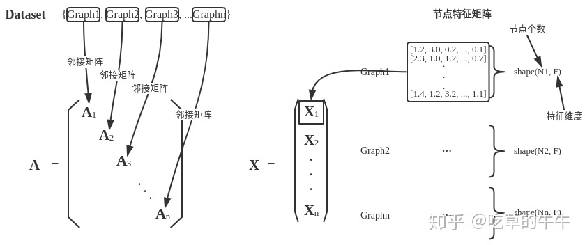

<details open><!-- 可选open -->
<summary>Contents</summary>
<div markdown="1">
<!-- TOC -->

- [以ENZYMES数据集示例Batch](#以enzymes数据集示例batch)
- [自定义数据集](#自定义数据集)
    - [Creating “In Memory Datasets”](#creating-in-memory-datasets)
    - [Creating “Larger” Datasets](#creating-larger-datasets)
- [NeighborSampler的使用](#neighborsampler的使用)

<!-- /TOC -->
</div>
</details>

> [*PyTorch Geometric* (PyG)](https://github.com/rusty1s/pytorch_geometric) is a geometric deep learning extension library for PyTorch.
<br>

 ## [torch_geometric.data](https://pytorch-geometric.readthedocs.io/en/latest/modules/data.html#module-torch_geometric.data)

**共以下十个类：**

- 单（个/批）图数据：
  - **Data**: A plain old python object modeling a single graph with various (optional) attributes
  - **Batch**: A plain old python object modeling a batch of graphs as one big (dicconnected) graph.
    -  With `torch_geometric.data.Data` being the base class, all its methods can also be used here. 
    - In addition, single graphs can be reconstructed via the assignment vector `batch`, which maps each node to its respective graph identifier.

- 为数据集创建提供的两个抽象类（ [官方教程](https://pytorch-geometric.readthedocs.io/en/latest/notes/create_dataset.html#creating-in-memory-datasets) ）：
  - **Dataset**: Dataset base class for creating graph datasets. 
  - **InMemoryDataset**: ... fit completely into memory. （ torch_geometric.datasets 中的现有数据集多从此类继承）
  
<!--more-->

- 数据集分批载入：
  - **DataLoader**: Data loader which merges data objects from a `torch_geometric.data.dataset` to a mini-batch.
  - **DataListLoader**: 和DataLoader的唯一区别就是返回的不是Batch而是data组成的list；
  - **DenseDataLoader**: All graphs in the dataset needs to have the same shape for each its attributes.
  - **ClusterLoader**: Clusters/partitions a graph data object into multiple subgraphs, as motivated by the [“Cluster-GCN: An Efficient Algorithm for Training Deep and Large Graph Convolutional Networks”](https://arxiv.org/abs/1905.07953) paper.

- 子图采样（来自两篇论文）：
  - **NeighborSampler**: The neighbor sampler from the [“Inductive Representation Learning on Large Graphs”](https://arxiv.org/abs/1706.02216) paper which iterates over graph nodes in a mini-batch fashion and constructs sampled subgraphs of size `num_hops`.
  - **ClusterData**: Clusters/partitions a graph data object into multiple subgraphs, as motivated by the [“Cluster-GCN: An Efficient Algorithm for Training Deep and Large Graph Convolutional Networks”](https://arxiv.org/abs/1905.07953) paper.

## 以ENZYMES数据集示例Batch

> ENZYMES is a dataset of protein tertiary structures obtained from (Borgwardt et al., 2005) 
> consisting of 600 enzymes from the BRENDA enzyme database (Schomburg et al., 2004). 
> In this case the task is to correctly assign each enzyme to one of the 6 EC top-level 
> classes. 

以用于图分类的ENZYMES数据集（包含有600个graphs，6个类别）为例：

```python
# node_labels: (0,1,2); node_attr: 18 => node_features: 21
dataset = TUDataset(root='/tmp/ENZYMES', name='ENZYMES', use_node_attr=True)

print(dataset[0].keys)

>>> ['x', 'edge_index', 'y']

loader = DataLoader(dataset, batch_size=64, shuffle=True)
for batch in loader:
    print(batch)
    
>>> # 共 64*9+24=600 个graphs
    Batch(batch=[1979], edge_index=[2, 7754], x=[1979, 21], y=[64])
    Batch(batch=[2103], edge_index=[2, 8178], x=[2103, 21], y=[64])
    Batch(batch=[2350], edge_index=[2, 8956], x=[2350, 21], y=[64])
    Batch(batch=[2051], edge_index=[2, 7770], x=[2051, 21], y=[64])
    Batch(batch=[1949], edge_index=[2, 7362], x=[1949, 21], y=[64])
    Batch(batch=[1944], edge_index=[2, 7668], x=[1944, 21], y=[64])
    Batch(batch=[2227], edge_index=[2, 8320], x=[2227, 21], y=[64])
    Batch(batch=[2162], edge_index=[2, 7800], x=[2162, 21], y=[64])
    Batch(batch=[2133], edge_index=[2, 8162], x=[2133, 21], y=[64])
    Batch(batch=[682], edge_index=[2, 2594], x=[682, 21], y=[24])
```

关于此数据集Batch的属性说明如下：

- `edge_index`：连接边的source和target节点
- `x`：整个batch的节点特征矩阵
- `y`：graph标签
- `batch`：列向量，用于指示每个节点属于batch中的第几个graph

> PyG通过创建一个稀疏的块对角矩阵来实现并行化操作。<br>下图引自[《番外篇：PyG框架及Cora数据集简介》](https://zhuanlan.zhihu.com/p/78452993)。

<p style="text-align:left"></p>

## 自定义数据集

### Creating “In Memory Datasets”

必须实现的四个方法:

- [`torch_geometric.data.InMemoryDataset.raw_file_names()`](https://pytorch-geometric.readthedocs.io/en/latest/modules/data.html#torch_geometric.data.InMemoryDataset.raw_file_names):

  A list of files in the `raw_dir` which needs to be found in order to skip the download.

- [`torch_geometric.data.InMemoryDataset.processed_file_names()`](https://pytorch-geometric.readthedocs.io/en/latest/modules/data.html#torch_geometric.data.InMemoryDataset.processed_file_names):

  A list of files in the `processed_dir` which needs to be found in order to skip the processing.

- [`torch_geometric.data.InMemoryDataset.download()`](https://pytorch-geometric.readthedocs.io/en/latest/modules/data.html#torch_geometric.data.InMemoryDataset.download):

  Downloads raw data into `raw_dir`.

- [`torch_geometric.data.InMemoryDataset.process()`](https://pytorch-geometric.readthedocs.io/en/latest/modules/data.html#torch_geometric.data.InMemoryDataset.process):

  Processes raw data and saves it into the `processed_dir`.

下面实现一个MyOwnDatasetTest类：

```python
import torch
from torch_geometric.data import Data

from torch_geometric.data import DataLoader

import torch
from torch_geometric.data import InMemoryDataset


class MyOwnDatasetTest(InMemoryDataset):
    def __init__(self, root, transform=None, pre_transform=None):
        super(MyOwnDatasetTest, self).__init__(root, transform, pre_transform)
        self.data, self.slices = torch.load(self.processed_paths[0])

    @property
    def raw_file_names(self):
        return ['some_file_1', 'some_file_2']
        # pass

    @property
    def processed_file_names(self):
        return ['data.pt']

    def download(self):
        # Download to `self.raw_dir`.
        pass

    def process(self):
        # Read data into huge `Data` list.
        edge_index = torch.tensor([[0, 1],
                                   [1,2]
                                   ], dtype=torch.long)
        y1 = torch.tensor([0], dtype=torch.long)
        y2 = torch.tensor([1], dtype=torch.long)

        data1 = Data(edge_index=edge_index.t().contiguous(), y=y1)
        data2 = Data(edge_index=edge_index.t().contiguous(), y=y2)

        data_list = [data1, data2, data1]

        if self.pre_filter is not None:
            data_list = [data for data in data_list if self.pre_filter(data)]

        if self.pre_transform is not None:
            data_list = [self.pre_transform(data) for data in data_list]

        data, slices = self.collate(data_list)
        print(data,slices)
        torch.save((data, slices), self.processed_paths[0])
```

测试 MyOwnDatasetTest 类：

```python
dataset = MyOwnDatasetTest(root="./MyOwnDatasetTest")
>>>	# 生成了MyOwnDatasetTest文件夹，其下包含raw和processed两个文件夹
Processing...
Data(edge_index=[2, 6], y=[3]) {'edge_index': tensor([0, 2, 4, 6]), 'y': tensor([0, 1, 2, 3])}
Done!

loader = DataLoader(dataset, batch_size=2, shuffle=True)
for i in loader:
    for k in i.keys:
        print("%s:\t%s"%(k, i[k]))
        print('\n')
>>>
edge_index:	tensor([[0, 1, 3, 4],
        [1, 2, 4, 5]])
y:	tensor([0, 1])
batch:	tensor([0, 0, 0, 1, 1, 1])

edge_index:	tensor([[0, 1],
        [1, 2]])
y:	tensor([0])
batch:	tensor([0, 0, 0])
```

### Creating “Larger” Datasets

进一步再实现两个方法:

- [`torch_geometric.data.Dataset.len()`](https://pytorch-geometric.readthedocs.io/en/latest/modules/data.html#torch_geometric.data.Dataset.len):

  Returns the number of examples in your dataset.

- [`torch_geometric.data.Dataset.get()`](https://pytorch-geometric.readthedocs.io/en/latest/modules/data.html#torch_geometric.data.Dataset.get):

  Implements the logic to load a single graph.

跳过下载/处理？ 不重写 `download()` 和 `process()` 方法:

```python
class MyOwnDataset(Dataset):
    def __init__(self, transform=None, pre_transform=None):
        super(MyOwnDataset, self).__init__(None, transform, pre_transform)
```

并非一定要使用dataset，简单地将 [`torch_geometric.data.Data`](https://pytorch-geometric.readthedocs.io/en/latest/modules/data.html#torch_geometric.data.Data) 对象的列表传给 [`torch_geometric.data.DataLoader`](https://pytorch-geometric.readthedocs.io/en/latest/modules/data.html#torch_geometric.data.DataLoader) 类也可以。

 *e.g.*, when you want to create synthetic data on the fly without saving them explicitly to disk. 

```python
from torch_geometric.data import Data, DataLoader

data_list = [Data(...), ..., Data(...)]
loader = DataLoader(data_list, batch_size=32)
```

## NeighborSampler的使用

依然使用ENZYMES数据集：

```python
print(dataset[0].num_nodes)
>>> 16

from torch_geometric.data import NeighborSampler
sampler = NeighborSampler(dataset[0], 1.0, 2, shuffle=True)	# 100%的2跳邻居
for i in sampler.__get_batches__(): # b_id
    print(sampler.__produce_subgraph__(i))
>>> # 16 subgraphs
Data(b_id=[1], e_id=[18], edge_index=[2, 18], n_id=[8], sub_b_id=[1])
Data(b_id=[1], e_id=[27], edge_index=[2, 27], n_id=[12], sub_b_id=[1])
Data(b_id=[1], e_id=[28], edge_index=[2, 28], n_id=[11], sub_b_id=[1])
Data(b_id=[1], e_id=[23], edge_index=[2, 23], n_id=[10], sub_b_id=[1])
Data(b_id=[1], e_id=[10], edge_index=[2, 10], n_id=[7], sub_b_id=[1])
Data(b_id=[1], e_id=[17], edge_index=[2, 17], n_id=[7], sub_b_id=[1])
Data(b_id=[1], e_id=[15], edge_index=[2, 15], n_id=[8], sub_b_id=[1])
Data(b_id=[1], e_id=[20], edge_index=[2, 20], n_id=[10], sub_b_id=[1])
Data(b_id=[1], e_id=[14], edge_index=[2, 14], n_id=[6], sub_b_id=[1])
Data(b_id=[1], e_id=[33], edge_index=[2, 33], n_id=[12], sub_b_id=[1])
Data(b_id=[1], e_id=[23], edge_index=[2, 23], n_id=[10], sub_b_id=[1])
Data(b_id=[1], e_id=[12], edge_index=[2, 12], n_id=[8], sub_b_id=[1])
Data(b_id=[1], e_id=[24], edge_index=[2, 24], n_id=[11], sub_b_id=[1])
Data(b_id=[1], e_id=[16], edge_index=[2, 16], n_id=[10], sub_b_id=[1])
Data(b_id=[1], e_id=[24], edge_index=[2, 24], n_id=[10], sub_b_id=[1])
Data(b_id=[1], e_id=[14], edge_index=[2, 14], n_id=[8], sub_b_id=[1])
```

查看其中一个子图的Data：

```python
Data(b_id=[1], e_id=[10], edge_index=[2, 10], n_id=[7], sub_b_id=[1])
edge_index: 
tensor([[6, 2, 0, 3, 0, 6, 2, 5, 1, 4],
        [4, 4, 4, 5, 5, 5, 5, 6, 5, 6]])
e_id: 
tensor([19,  1, 49, 35, 48, 18,  0,  4, 38, 21])
n_id: 
tensor([13, 11,  0, 10,  6,  1,  5])
b_id: 
tensor([5])
sub_b_id: 
tensor([6])
```

- b_id: target点在大图中的序号

- e_id: 边在大图中的序号
- edge_index: 子图节点序号表示的边连接关系
- n_id: 子图中所有点在大图中的序号
- b_id: target点在子图中的序号