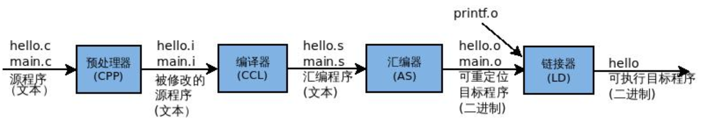
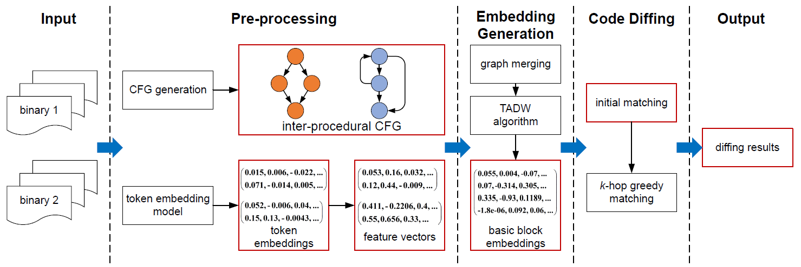
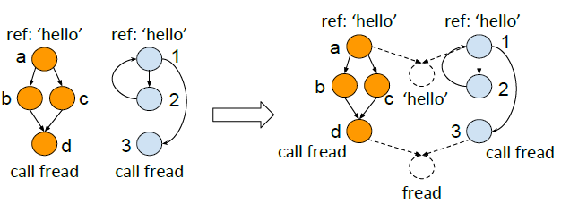
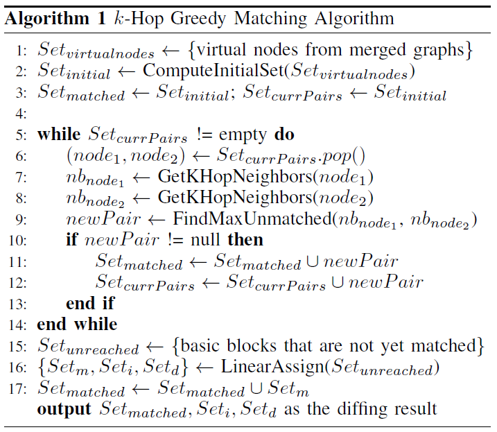

<!-- 可选open -->

Contents

<!-- TOC -->

- [Binary Diffing](#binary-diffing)
    - [问题定义](#%E9%97%AE%E9%A2%98%E5%AE%9A%E4%B9%89)
    - [解决方法](#%E8%A7%A3%E5%86%B3%E6%96%B9%E6%B3%95)
- [二进制文件预处理](#%E4%BA%8C%E8%BF%9B%E5%88%B6%E6%96%87%E4%BB%B6%E9%A2%84%E5%A4%84%E7%90%86)
    - [生成程序的ICFG](#%E7%94%9F%E6%88%90%E7%A8%8B%E5%BA%8F%E7%9A%84icfg)
    - [生成基本块的特征向量](#%E7%94%9F%E6%88%90%E5%9F%BA%E6%9C%AC%E5%9D%97%E7%9A%84%E7%89%B9%E5%BE%81%E5%90%91%E9%87%8F)
- [基本块的嵌入表示](#%E5%9F%BA%E6%9C%AC%E5%9D%97%E7%9A%84%E5%B5%8C%E5%85%A5%E8%A1%A8%E7%A4%BA)
- [代码差异比较](#%E4%BB%A3%E7%A0%81%E5%B7%AE%E5%BC%82%E6%AF%94%E8%BE%83)

<!-- /TOC -->

## Binary Diffing

### 问题定义

对于给定的两个二进制程序 $$p_1=(B_1, E_1)$$ 以及 $$p_2=(B_2, E_2)$$ ，找到最优的代码块匹配，使得 $$p_1$$ 和 $$p_2$$ 之间的相似度尽可能大：

$$SIM(p_1,p_2)=\underset{m_1,m_2,...,m_k\in{M(p_1,p_2)}}{\max}\sum_{i=1}^ksim(m_i)$$

### 解决方法

**DeepBinDiff** 将问题分解为两个子任务：

1. 找到一个能量化两个基本块相似性的度量方法 $$sim(m_i)$$ 
   - 无监督学习（unsupervised learning）生成嵌入（embeddings）
2. 找到两个基本块集合间的最优匹配 $$M(p_1,p_2)$$
   - k跳贪婪匹配算法（k-hop greedy matching algorithm）

<!--more-->

`Assumptions` 对输入的二进制文件有以下设定：

- 经过strip（删除了符号表和调试信息），没有源代码和符号信息（如函数名）。`商用软件（COTS: Commercial off-the-shelf）通常经过strip，恶意软件也往往不包含符号信息`

- 未被打包，但可以是被不同编译器优化方法转换的。

  <figure>
  <figcaption>图 gcc编译C程序过程</figcaption></figure>

  > .java $$\overset{compile}\Longrightarrow$$ .class / .dex $$\overset{pack}\Longrightarrow$$ .jar / .apk

- 两个二进制文件是在相同架构下的。目前只支持 x86。`后续工作可扩展到跨平台：利用中间语言（IR: Intermediate Representation）级别上的分析`

## 二进制文件预处理

### 生成程序的ICFG

`control dependency information`

inter-procedural CFG：程序间控制流图

> 一个子程序（subroutine），如一个函数的控制流图（CFG）称作程序内（intra-procedural）的

- 结合了函数调用图（call graph）和每个函数的控制流图（control-flow graph）
- 提供了程序级别的上下文信息（program-wide contextual information），利于区分相似代码块在不同上下文位置的语义

### 生成基本块的特征向量

`semantic information`

首先根据 `Word2Vec` 算法训练一个 token embedding 模型，生成标识（操作码 / 操作数）的嵌入。

1. 指令序列化：ICFG上的随机游走
   - 基本块的完全覆盖：每个基本块至少被2条随机游走路径包含
   - 足够的控制流信息：每条随机游走路径的长度为5个基本块

2. 正则化（不同编译选项造成的差异）

   - 所有数值化常量都用 ‘im’ 代替
   - 所有通用寄存器都依据它们的位数重命名
   - 指针被替换为字符串 ‘ptr’

   > InnerEye将字符串都替换成<STR>，而DeepBinDiff保留了字符串原义

3. 模型训练：将正则化后的随机游走路径作为训练样本，输入CBOW（Continuous Bag-of-Words）模型

最后利用标识嵌入来生成基本块的特征向量。

4. 基本块的特征向量：块中所有指令的嵌入的加和

   - `instruction = opcode + (n * operands)`  $$E(指令)=w*E(操作码)\mid\mid\overline{E(操作数)}$$

   - 操作码的权重w由TF-IDF模型确定。加权的原因主要是减少编译优化带来的差异。

     > 例：GCC v5.4实现`printf`方法时，O0用了3个`mov`指令，而O1只用了1个。因此在匹配时，`mov`指令相较`call`重要性偏小

## 基本块的嵌入表示

目标：相似的基本块具有较相近的嵌入。

方法：先将两个ICFG**合并**为一个图，再将问题建模成一个网络的表示学习问题，使用**TADW**（Text-associated DeepWalk）算法来生成基本块的嵌入表示。

- TADW：对DeepWalk算法的改进，能够将节点特征包含到表示学习过程中。（[论文](https://www.ijcai.org/Proceedings/15/Papers/299.pdf)证明了DeepWalk实质是一个矩阵分解的过程，基于在分解过程中加入对文本特征信息的考虑，提出了新的矩阵分解形式）

  

- 合并图的原因：在两张图上分别运行TADW算法效率低，且可能在相似性检测中错失一些重要指标。

- 合并图的方法：提取基本块中的**字符串**和**外部库/系统调用**，为字符串和库函数创造虚拟节点；再通过虚拟节点将两张图合并。通过这种方法，相似节点至少拥有一个共同的邻居节点，且共享较相似的邻居。

## 代码差异比较

目标：找到使得两个输入的二进制文件相似度最高的匹配方案	`赋权图匹配问题`

k跳贪婪匹配算法（线性分配的改进）

2: 提取虚拟点的直接邻居，通过基本块的嵌入表示，求得初始最佳匹配对的集合

> 循环

7-8: 从一个已匹配对入手，分别在合并的ICFG上搜索它们的k阶邻居

9: 将所有k阶邻居的相似度进行排序，挑出最大的且大于预定义阈值0.6的一对

> 循环结束：所有匹配对被搜索完

15: 剩余的未匹配块：执行不到的代码块（dead code）或在k阶邻居内相似度较低

16: 在剩余未匹配块中使用线性分配算法**Hungarian**。返回结果中$$Set_m$$为匹配的，$$Set_i$$为插入的，$$Set_d$$为删除的。