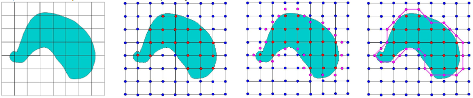
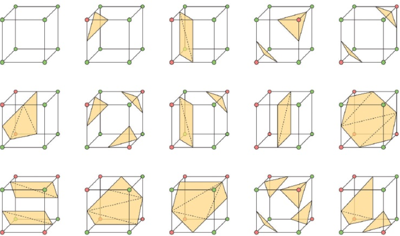

<details open><!-- 可选open -->
<summary>Contents</summary>
<div markdown="1">
<!-- TOC -->

   - [Marching Cube (移动立方体)](#01-MarchingCube(移动立方体))
      - [[如何理解](http://www.cs.carleton.edu/cs_comps/0405/shape/marching_cubes.html)](#011-[如何理解](http://www.cs.carleton.edu/cs_comps/0405/shape/marching_cubes.html))
      - [[算法步骤](https://blog.csdn.net/jjl199299/article/details/52036886)](#012-[算法步骤](https://blog.csdn.net/jjl199299/article/details/52036886))
   - [[C++ 实现](https://github.com/E0HYL/TorchMarchingCubes)](#02-[C++实现](https://github.com/E0HYL/TorchMarchingCubes))

<!-- /TOC -->
</div>
</details>

<a id="toc_anchor" name="#01-MarchingCube(移动立方体)"></a>

## 0.1. Marching Cube (移动立方体)

<a id="toc_anchor" name="#011-[如何理解](http://www.cs.carleton.edu/cs_comps/0405/shape/marching_cubes.html)"></a>

### 0.1.1. [如何理解](http://www.cs.carleton.edu/cs_comps/0405/shape/marching_cubes.html)

简单的 2D “移动正方形”

1. 将目标表面分割为小正方形
2. 标注每个小正方形的顶点在目标表面内还是外（红内蓝外）
3. 一角在内一角在外的边上，一定存在目标表面和小正方形的交点（紫）
4. 把所有小正方形上的紫点连接起来，可以获得原有表面的近似



<a id="toc_anchor" name="#012-[算法步骤](https://blog.csdn.net/jjl199299/article/details/52036886)"></a>

### 0.1.2. [算法步骤](https://blog.csdn.net/jjl199299/article/details/52036886)

1. 将三维空间分割为小立方体（体素）。

   对一个体素的8个顶点和12条边分别进行编号；

   根据对称关系构建一个256种（每个顶点有内/外两种状态）相交关系的索引表，该表指明等值面与体素的哪条边相交。15种基本情形，其他241种情形可以通过这15种基本情形的旋转、映射等方式实现：

   

   遍历三维图像的所有体素，对每个体素执行2~4：

2. 根据每个顶点与阈值的比较确定该顶点在面内还是面外。

3. 把这8个顶点构成的01串组成一个8位的索引值，用索引值在边索引表里查找对应的相交关系，并用插值算法求出与立方体每条边的交点。

4. 用交点构成三角形面片或者是多边形面片。

<a id="toc_anchor" name="#02-[C++实现](https://github.com/E0HYL/TorchMarchingCubes)"></a>

## 0.2. [C++ 实现](https://github.com/E0HYL/TorchMarchingCubes)

1. 主要数据结构：点，面片，体素

   ```c++
   struct XYZ {
       explicit XYZ(float x = 0.0f, float y = 0.0f, float z = 0.0f) : x(x), y(y), z(z) {}
       bool operator==(const XYZ &xyz) const { return x == xyz.x && y == xyz.y && z == xyz.z; }
       XYZ operator+(const XYZ &xyz) const { return XYZ(x + xyz.x, y + xyz.y, z + xyz.z); }
       XYZ operator*(float s) const { return XYZ(x * s, y * s, z * s); }
       float x, y, z;
   };
   
   struct TRIANGLE {
      XYZ p[3];
   };
   
   struct GRIDCELL {
      XYZ p[8];
      float val[8];
   };
   ```

2. 等值面提取（体素）

   ```c++
   /*
      输入：体素，阈值，存储等值面的指针
      输出：等值面个数（等值面在第三个输入参数指向的数组中）
   */
   int Polygonise(GRIDCELL grid, float isolevel, TRIANGLE *triangles)
   {
      int i,ntriang;
      int cubeindex;
      XYZ vertlist[12];
   
      static int edgeTable[256]={	// 边表（12位二进制数），对应256种情况；通过8位的顶点状态索引
           0x0  , 0x109, 0x203, 0x30a, 0x406, 0x50f, 0x605, 0x70c,
           0x80c, 0x905, 0xa0f, 0xb06, 0xc0a, 0xd03, 0xe09, 0xf00,
           0x190, 0x99 , 0x393, 0x29a, 0x596, 0x49f, 0x795, 0x69c,
           0x99c, 0x895, 0xb9f, 0xa96, 0xd9a, 0xc93, 0xf99, 0xe90,
           0x230, 0x339, 0x33 , 0x13a, 0x636, 0x73f, 0x435, 0x53c,
           0xa3c, 0xb35, 0x83f, 0x936, 0xe3a, 0xf33, 0xc39, 0xd30,
           0x3a0, 0x2a9, 0x1a3, 0xaa , 0x7a6, 0x6af, 0x5a5, 0x4ac,
           0xbac, 0xaa5, 0x9af, 0x8a6, 0xfaa, 0xea3, 0xda9, 0xca0,
           0x460, 0x569, 0x663, 0x76a, 0x66 , 0x16f, 0x265, 0x36c,
           0xc6c, 0xd65, 0xe6f, 0xf66, 0x86a, 0x963, 0xa69, 0xb60,
           0x5f0, 0x4f9, 0x7f3, 0x6fa, 0x1f6, 0xff , 0x3f5, 0x2fc,
           0xdfc, 0xcf5, 0xfff, 0xef6, 0x9fa, 0x8f3, 0xbf9, 0xaf0,
           0x650, 0x759, 0x453, 0x55a, 0x256, 0x35f, 0x55 , 0x15c,
           0xe5c, 0xf55, 0xc5f, 0xd56, 0xa5a, 0xb53, 0x859, 0x950,
           0x7c0, 0x6c9, 0x5c3, 0x4ca, 0x3c6, 0x2cf, 0x1c5, 0xcc ,
           0xfcc, 0xec5, 0xdcf, 0xcc6, 0xbca, 0xac3, 0x9c9, 0x8c0,
           0x8c0, 0x9c9, 0xac3, 0xbca, 0xcc6, 0xdcf, 0xec5, 0xfcc,
           0xcc , 0x1c5, 0x2cf, 0x3c6, 0x4ca, 0x5c3, 0x6c9, 0x7c0,
           0x950, 0x859, 0xb53, 0xa5a, 0xd56, 0xc5f, 0xf55, 0xe5c,
           0x15c, 0x55 , 0x35f, 0x256, 0x55a, 0x453, 0x759, 0x650,
           0xaf0, 0xbf9, 0x8f3, 0x9fa, 0xef6, 0xfff, 0xcf5, 0xdfc,
           0x2fc, 0x3f5, 0xff , 0x1f6, 0x6fa, 0x7f3, 0x4f9, 0x5f0,
           0xb60, 0xa69, 0x963, 0x86a, 0xf66, 0xe6f, 0xd65, 0xc6c,
           0x36c, 0x265, 0x16f, 0x66 , 0x76a, 0x663, 0x569, 0x460,
           0xca0, 0xda9, 0xea3, 0xfaa, 0x8a6, 0x9af, 0xaa5, 0xbac,
           0x4ac, 0x5a5, 0x6af, 0x7a6, 0xaa , 0x1a3, 0x2a9, 0x3a0,
           0xd30, 0xc39, 0xf33, 0xe3a, 0x936, 0x83f, 0xb35, 0xa3c,
           0x53c, 0x435, 0x73f, 0x636, 0x13a, 0x33 , 0x339, 0x230,
           0xe90, 0xf99, 0xc93, 0xd9a, 0xa96, 0xb9f, 0x895, 0x99c,
           0x69c, 0x795, 0x49f, 0x596, 0x29a, 0x393, 0x99 , 0x190,
           0xf00, 0xe09, 0xd03, 0xc0a, 0xb06, 0xa0f, 0x905, 0x80c,
           0x70c, 0x605, 0x50f, 0x406, 0x30a, 0x203, 0x109, 0x0  
       };
   
       static int triTable[256][16] ={	// 三角形表，对应256种情况；16个元素的列表，因为最多5个等值面，不为-1的元素表示在该编号的边上有交点
           {-1, -1, -1, -1, -1, -1, -1, -1, -1, -1, -1, -1, -1, -1, -1, -1},
           {0, 8, 3, -1, -1, -1, -1, -1, -1, -1, -1, -1, -1, -1, -1, -1},
           {0, 1, 9, -1, -1, -1, -1, -1, -1, -1, -1, -1, -1, -1, -1, -1},
           {1, 8, 3, 9, 8, 1, -1, -1, -1, -1, -1, -1, -1, -1, -1, -1},
           {1, 2, 10, -1, -1, -1, -1, -1, -1, -1, -1, -1, -1, -1, -1, -1},
           {0, 8, 3, 1, 2, 10, -1, -1, -1, -1, -1, -1, -1, -1, -1, -1},
           {9, 2, 10, 0, 2, 9, -1, -1, -1, -1, -1, -1, -1, -1, -1, -1},
           {2, 8, 3, 2, 10, 8, 10, 9, 8, -1, -1, -1, -1, -1, -1, -1},
           {3, 11, 2, -1, -1, -1, -1, -1, -1, -1, -1, -1, -1, -1, -1, -1},
           {0, 11, 2, 8, 11, 0, -1, -1, -1, -1, -1, -1, -1, -1, -1, -1},
           {1, 9, 0, 2, 3, 11, -1, -1, -1, -1, -1, -1, -1, -1, -1, -1},
           {1, 11, 2, 1, 9, 11, 9, 8, 11, -1, -1, -1, -1, -1, -1, -1},
           {3, 10, 1, 11, 10, 3, -1, -1, -1, -1, -1, -1, -1, -1, -1, -1},
           {0, 10, 1, 0, 8, 10, 8, 11, 10, -1, -1, -1, -1, -1, -1, -1},
           {3, 9, 0, 3, 11, 9, 11, 10, 9, -1, -1, -1, -1, -1, -1, -1},
           {9, 8, 10, 10, 8, 11, -1, -1, -1, -1, -1, -1, -1, -1, -1, -1},
           {4, 7, 8, -1, -1, -1, -1, -1, -1, -1, -1, -1, -1, -1, -1, -1},
           {4, 3, 0, 7, 3, 4, -1, -1, -1, -1, -1, -1, -1, -1, -1, -1},
           {0, 1, 9, 8, 4, 7, -1, -1, -1, -1, -1, -1, -1, -1, -1, -1},
           {4, 1, 9, 4, 7, 1, 7, 3, 1, -1, -1, -1, -1, -1, -1, -1},
           {1, 2, 10, 8, 4, 7, -1, -1, -1, -1, -1, -1, -1, -1, -1, -1},
           {3, 4, 7, 3, 0, 4, 1, 2, 10, -1, -1, -1, -1, -1, -1, -1},
           {9, 2, 10, 9, 0, 2, 8, 4, 7, -1, -1, -1, -1, -1, -1, -1},
           {2, 10, 9, 2, 9, 7, 2, 7, 3, 7, 9, 4, -1, -1, -1, -1},
           {8, 4, 7, 3, 11, 2, -1, -1, -1, -1, -1, -1, -1, -1, -1, -1},
           {11, 4, 7, 11, 2, 4, 2, 0, 4, -1, -1, -1, -1, -1, -1, -1},
           {9, 0, 1, 8, 4, 7, 2, 3, 11, -1, -1, -1, -1, -1, -1, -1},
           {4, 7, 11, 9, 4, 11, 9, 11, 2, 9, 2, 1, -1, -1, -1, -1},
           {3, 10, 1, 3, 11, 10, 7, 8, 4, -1, -1, -1, -1, -1, -1, -1},
           {1, 11, 10, 1, 4, 11, 1, 0, 4, 7, 11, 4, -1, -1, -1, -1},
           {4, 7, 8, 9, 0, 11, 9, 11, 10, 11, 0, 3, -1, -1, -1, -1},
           {4, 7, 11, 4, 11, 9, 9, 11, 10, -1, -1, -1, -1, -1, -1, -1},
           {9, 5, 4, -1, -1, -1, -1, -1, -1, -1, -1, -1, -1, -1, -1, -1},
           {9, 5, 4, 0, 8, 3, -1, -1, -1, -1, -1, -1, -1, -1, -1, -1},
           {0, 5, 4, 1, 5, 0, -1, -1, -1, -1, -1, -1, -1, -1, -1, -1},
           {8, 5, 4, 8, 3, 5, 3, 1, 5, -1, -1, -1, -1, -1, -1, -1},
           {1, 2, 10, 9, 5, 4, -1, -1, -1, -1, -1, -1, -1, -1, -1, -1},
           {3, 0, 8, 1, 2, 10, 4, 9, 5, -1, -1, -1, -1, -1, -1, -1},
           {5, 2, 10, 5, 4, 2, 4, 0, 2, -1, -1, -1, -1, -1, -1, -1},
           {2, 10, 5, 3, 2, 5, 3, 5, 4, 3, 4, 8, -1, -1, -1, -1},
           {9, 5, 4, 2, 3, 11, -1, -1, -1, -1, -1, -1, -1, -1, -1, -1},
           {0, 11, 2, 0, 8, 11, 4, 9, 5, -1, -1, -1, -1, -1, -1, -1},
           {0, 5, 4, 0, 1, 5, 2, 3, 11, -1, -1, -1, -1, -1, -1, -1},
           {2, 1, 5, 2, 5, 8, 2, 8, 11, 4, 8, 5, -1, -1, -1, -1},
           {10, 3, 11, 10, 1, 3, 9, 5, 4, -1, -1, -1, -1, -1, -1, -1},
           {4, 9, 5, 0, 8, 1, 8, 10, 1, 8, 11, 10, -1, -1, -1, -1},
           {5, 4, 0, 5, 0, 11, 5, 11, 10, 11, 0, 3, -1, -1, -1, -1},
           {5, 4, 8, 5, 8, 10, 10, 8, 11, -1, -1, -1, -1, -1, -1, -1},
           {9, 7, 8, 5, 7, 9, -1, -1, -1, -1, -1, -1, -1, -1, -1, -1},
           {9, 3, 0, 9, 5, 3, 5, 7, 3, -1, -1, -1, -1, -1, -1, -1},
           {0, 7, 8, 0, 1, 7, 1, 5, 7, -1, -1, -1, -1, -1, -1, -1},
           {1, 5, 3, 3, 5, 7, -1, -1, -1, -1, -1, -1, -1, -1, -1, -1},
           {9, 7, 8, 9, 5, 7, 10, 1, 2, -1, -1, -1, -1, -1, -1, -1},
           {10, 1, 2, 9, 5, 0, 5, 3, 0, 5, 7, 3, -1, -1, -1, -1},
           {8, 0, 2, 8, 2, 5, 8, 5, 7, 10, 5, 2, -1, -1, -1, -1},
           {2, 10, 5, 2, 5, 3, 3, 5, 7, -1, -1, -1, -1, -1, -1, -1},
           {7, 9, 5, 7, 8, 9, 3, 11, 2, -1, -1, -1, -1, -1, -1, -1},
           {9, 5, 7, 9, 7, 2, 9, 2, 0, 2, 7, 11, -1, -1, -1, -1},
           {2, 3, 11, 0, 1, 8, 1, 7, 8, 1, 5, 7, -1, -1, -1, -1},
           {11, 2, 1, 11, 1, 7, 7, 1, 5, -1, -1, -1, -1, -1, -1, -1},
           {9, 5, 8, 8, 5, 7, 10, 1, 3, 10, 3, 11, -1, -1, -1, -1},
           {5, 7, 0, 5, 0, 9, 7, 11, 0, 1, 0, 10, 11, 10, 0, -1},
           {11, 10, 0, 11, 0, 3, 10, 5, 0, 8, 0, 7, 5, 7, 0, -1},
           {11, 10, 5, 7, 11, 5, -1, -1, -1, -1, -1, -1, -1, -1, -1, -1},
           {10, 6, 5, -1, -1, -1, -1, -1, -1, -1, -1, -1, -1, -1, -1, -1},
           {0, 8, 3, 5, 10, 6, -1, -1, -1, -1, -1, -1, -1, -1, -1, -1},
           {9, 0, 1, 5, 10, 6, -1, -1, -1, -1, -1, -1, -1, -1, -1, -1},
           {1, 8, 3, 1, 9, 8, 5, 10, 6, -1, -1, -1, -1, -1, -1, -1},
           {1, 6, 5, 2, 6, 1, -1, -1, -1, -1, -1, -1, -1, -1, -1, -1},
           {1, 6, 5, 1, 2, 6, 3, 0, 8, -1, -1, -1, -1, -1, -1, -1},
           {9, 6, 5, 9, 0, 6, 0, 2, 6, -1, -1, -1, -1, -1, -1, -1},
           {5, 9, 8, 5, 8, 2, 5, 2, 6, 3, 2, 8, -1, -1, -1, -1},
           {2, 3, 11, 10, 6, 5, -1, -1, -1, -1, -1, -1, -1, -1, -1, -1},
           {11, 0, 8, 11, 2, 0, 10, 6, 5, -1, -1, -1, -1, -1, -1, -1},
           {0, 1, 9, 2, 3, 11, 5, 10, 6, -1, -1, -1, -1, -1, -1, -1},
           {5, 10, 6, 1, 9, 2, 9, 11, 2, 9, 8, 11, -1, -1, -1, -1},
           {6, 3, 11, 6, 5, 3, 5, 1, 3, -1, -1, -1, -1, -1, -1, -1},
           {0, 8, 11, 0, 11, 5, 0, 5, 1, 5, 11, 6, -1, -1, -1, -1},
           {3, 11, 6, 0, 3, 6, 0, 6, 5, 0, 5, 9, -1, -1, -1, -1},
           {6, 5, 9, 6, 9, 11, 11, 9, 8, -1, -1, -1, -1, -1, -1, -1},
           {5, 10, 6, 4, 7, 8, -1, -1, -1, -1, -1, -1, -1, -1, -1, -1},
           {4, 3, 0, 4, 7, 3, 6, 5, 10, -1, -1, -1, -1, -1, -1, -1},
           {1, 9, 0, 5, 10, 6, 8, 4, 7, -1, -1, -1, -1, -1, -1, -1},
           {10, 6, 5, 1, 9, 7, 1, 7, 3, 7, 9, 4, -1, -1, -1, -1},
           {6, 1, 2, 6, 5, 1, 4, 7, 8, -1, -1, -1, -1, -1, -1, -1},
           {1, 2, 5, 5, 2, 6, 3, 0, 4, 3, 4, 7, -1, -1, -1, -1},
           {8, 4, 7, 9, 0, 5, 0, 6, 5, 0, 2, 6, -1, -1, -1, -1},
           {7, 3, 9, 7, 9, 4, 3, 2, 9, 5, 9, 6, 2, 6, 9, -1},
           {3, 11, 2, 7, 8, 4, 10, 6, 5, -1, -1, -1, -1, -1, -1, -1},
           {5, 10, 6, 4, 7, 2, 4, 2, 0, 2, 7, 11, -1, -1, -1, -1},
           {0, 1, 9, 4, 7, 8, 2, 3, 11, 5, 10, 6, -1, -1, -1, -1},
           {9, 2, 1, 9, 11, 2, 9, 4, 11, 7, 11, 4, 5, 10, 6, -1},
           {8, 4, 7, 3, 11, 5, 3, 5, 1, 5, 11, 6, -1, -1, -1, -1},
           {5, 1, 11, 5, 11, 6, 1, 0, 11, 7, 11, 4, 0, 4, 11, -1},
           {0, 5, 9, 0, 6, 5, 0, 3, 6, 11, 6, 3, 8, 4, 7, -1},
           {6, 5, 9, 6, 9, 11, 4, 7, 9, 7, 11, 9, -1, -1, -1, -1},
           {10, 4, 9, 6, 4, 10, -1, -1, -1, -1, -1, -1, -1, -1, -1, -1},
           {4, 10, 6, 4, 9, 10, 0, 8, 3, -1, -1, -1, -1, -1, -1, -1},
           {10, 0, 1, 10, 6, 0, 6, 4, 0, -1, -1, -1, -1, -1, -1, -1},
           {8, 3, 1, 8, 1, 6, 8, 6, 4, 6, 1, 10, -1, -1, -1, -1},
           {1, 4, 9, 1, 2, 4, 2, 6, 4, -1, -1, -1, -1, -1, -1, -1},
           {3, 0, 8, 1, 2, 9, 2, 4, 9, 2, 6, 4, -1, -1, -1, -1},
           {0, 2, 4, 4, 2, 6, -1, -1, -1, -1, -1, -1, -1, -1, -1, -1},
           {8, 3, 2, 8, 2, 4, 4, 2, 6, -1, -1, -1, -1, -1, -1, -1},
           {10, 4, 9, 10, 6, 4, 11, 2, 3, -1, -1, -1, -1, -1, -1, -1},
           {0, 8, 2, 2, 8, 11, 4, 9, 10, 4, 10, 6, -1, -1, -1, -1},
           {3, 11, 2, 0, 1, 6, 0, 6, 4, 6, 1, 10, -1, -1, -1, -1},
           {6, 4, 1, 6, 1, 10, 4, 8, 1, 2, 1, 11, 8, 11, 1, -1},
           {9, 6, 4, 9, 3, 6, 9, 1, 3, 11, 6, 3, -1, -1, -1, -1},
           {8, 11, 1, 8, 1, 0, 11, 6, 1, 9, 1, 4, 6, 4, 1, -1},
           {3, 11, 6, 3, 6, 0, 0, 6, 4, -1, -1, -1, -1, -1, -1, -1},
           {6, 4, 8, 11, 6, 8, -1, -1, -1, -1, -1, -1, -1, -1, -1, -1},
           {7, 10, 6, 7, 8, 10, 8, 9, 10, -1, -1, -1, -1, -1, -1, -1},
           {0, 7, 3, 0, 10, 7, 0, 9, 10, 6, 7, 10, -1, -1, -1, -1},
           {10, 6, 7, 1, 10, 7, 1, 7, 8, 1, 8, 0, -1, -1, -1, -1},
           {10, 6, 7, 10, 7, 1, 1, 7, 3, -1, -1, -1, -1, -1, -1, -1},
           {1, 2, 6, 1, 6, 8, 1, 8, 9, 8, 6, 7, -1, -1, -1, -1},
           {2, 6, 9, 2, 9, 1, 6, 7, 9, 0, 9, 3, 7, 3, 9, -1},
           {7, 8, 0, 7, 0, 6, 6, 0, 2, -1, -1, -1, -1, -1, -1, -1},
           {7, 3, 2, 6, 7, 2, -1, -1, -1, -1, -1, -1, -1, -1, -1, -1},
           {2, 3, 11, 10, 6, 8, 10, 8, 9, 8, 6, 7, -1, -1, -1, -1},
           {2, 0, 7, 2, 7, 11, 0, 9, 7, 6, 7, 10, 9, 10, 7, -1},
           {1, 8, 0, 1, 7, 8, 1, 10, 7, 6, 7, 10, 2, 3, 11, -1},
           {11, 2, 1, 11, 1, 7, 10, 6, 1, 6, 7, 1, -1, -1, -1, -1},
           {8, 9, 6, 8, 6, 7, 9, 1, 6, 11, 6, 3, 1, 3, 6, -1},
           {0, 9, 1, 11, 6, 7, -1, -1, -1, -1, -1, -1, -1, -1, -1, -1},
           {7, 8, 0, 7, 0, 6, 3, 11, 0, 11, 6, 0, -1, -1, -1, -1},
           {7, 11, 6, -1, -1, -1, -1, -1, -1, -1, -1, -1, -1, -1, -1, -1},
           {7, 6, 11, -1, -1, -1, -1, -1, -1, -1, -1, -1, -1, -1, -1, -1},
           {3, 0, 8, 11, 7, 6, -1, -1, -1, -1, -1, -1, -1, -1, -1, -1},
           {0, 1, 9, 11, 7, 6, -1, -1, -1, -1, -1, -1, -1, -1, -1, -1},
           {8, 1, 9, 8, 3, 1, 11, 7, 6, -1, -1, -1, -1, -1, -1, -1},
           {10, 1, 2, 6, 11, 7, -1, -1, -1, -1, -1, -1, -1, -1, -1, -1},
           {1, 2, 10, 3, 0, 8, 6, 11, 7, -1, -1, -1, -1, -1, -1, -1},
           {2, 9, 0, 2, 10, 9, 6, 11, 7, -1, -1, -1, -1, -1, -1, -1},
           {6, 11, 7, 2, 10, 3, 10, 8, 3, 10, 9, 8, -1, -1, -1, -1},
           {7, 2, 3, 6, 2, 7, -1, -1, -1, -1, -1, -1, -1, -1, -1, -1},
           {7, 0, 8, 7, 6, 0, 6, 2, 0, -1, -1, -1, -1, -1, -1, -1},
           {2, 7, 6, 2, 3, 7, 0, 1, 9, -1, -1, -1, -1, -1, -1, -1},
           {1, 6, 2, 1, 8, 6, 1, 9, 8, 8, 7, 6, -1, -1, -1, -1},
           {10, 7, 6, 10, 1, 7, 1, 3, 7, -1, -1, -1, -1, -1, -1, -1},
           {10, 7, 6, 1, 7, 10, 1, 8, 7, 1, 0, 8, -1, -1, -1, -1},
           {0, 3, 7, 0, 7, 10, 0, 10, 9, 6, 10, 7, -1, -1, -1, -1},
           {7, 6, 10, 7, 10, 8, 8, 10, 9, -1, -1, -1, -1, -1, -1, -1},
           {6, 8, 4, 11, 8, 6, -1, -1, -1, -1, -1, -1, -1, -1, -1, -1},
           {3, 6, 11, 3, 0, 6, 0, 4, 6, -1, -1, -1, -1, -1, -1, -1},
           {8, 6, 11, 8, 4, 6, 9, 0, 1, -1, -1, -1, -1, -1, -1, -1},
           {9, 4, 6, 9, 6, 3, 9, 3, 1, 11, 3, 6, -1, -1, -1, -1},
           {6, 8, 4, 6, 11, 8, 2, 10, 1, -1, -1, -1, -1, -1, -1, -1},
           {1, 2, 10, 3, 0, 11, 0, 6, 11, 0, 4, 6, -1, -1, -1, -1},
           {4, 11, 8, 4, 6, 11, 0, 2, 9, 2, 10, 9, -1, -1, -1, -1},
           {10, 9, 3, 10, 3, 2, 9, 4, 3, 11, 3, 6, 4, 6, 3, -1},
           {8, 2, 3, 8, 4, 2, 4, 6, 2, -1, -1, -1, -1, -1, -1, -1},
           {0, 4, 2, 4, 6, 2, -1, -1, -1, -1, -1, -1, -1, -1, -1, -1},
           {1, 9, 0, 2, 3, 4, 2, 4, 6, 4, 3, 8, -1, -1, -1, -1},
           {1, 9, 4, 1, 4, 2, 2, 4, 6, -1, -1, -1, -1, -1, -1, -1},
           {8, 1, 3, 8, 6, 1, 8, 4, 6, 6, 10, 1, -1, -1, -1, -1},
           {10, 1, 0, 10, 0, 6, 6, 0, 4, -1, -1, -1, -1, -1, -1, -1},
           {4, 6, 3, 4, 3, 8, 6, 10, 3, 0, 3, 9, 10, 9, 3, -1},
           {10, 9, 4, 6, 10, 4, -1, -1, -1, -1, -1, -1, -1, -1, -1, -1},
           {4, 9, 5, 7, 6, 11, -1, -1, -1, -1, -1, -1, -1, -1, -1, -1},
           {0, 8, 3, 4, 9, 5, 11, 7, 6, -1, -1, -1, -1, -1, -1, -1},
           {5, 0, 1, 5, 4, 0, 7, 6, 11, -1, -1, -1, -1, -1, -1, -1},
           {11, 7, 6, 8, 3, 4, 3, 5, 4, 3, 1, 5, -1, -1, -1, -1},
           {9, 5, 4, 10, 1, 2, 7, 6, 11, -1, -1, -1, -1, -1, -1, -1},
           {6, 11, 7, 1, 2, 10, 0, 8, 3, 4, 9, 5, -1, -1, -1, -1},
           {7, 6, 11, 5, 4, 10, 4, 2, 10, 4, 0, 2, -1, -1, -1, -1},
           {3, 4, 8, 3, 5, 4, 3, 2, 5, 10, 5, 2, 11, 7, 6, -1},
           {7, 2, 3, 7, 6, 2, 5, 4, 9, -1, -1, -1, -1, -1, -1, -1},
           {9, 5, 4, 0, 8, 6, 0, 6, 2, 6, 8, 7, -1, -1, -1, -1},
           {3, 6, 2, 3, 7, 6, 1, 5, 0, 5, 4, 0, -1, -1, -1, -1},
           {6, 2, 8, 6, 8, 7, 2, 1, 8, 4, 8, 5, 1, 5, 8, -1},
           {9, 5, 4, 10, 1, 6, 1, 7, 6, 1, 3, 7, -1, -1, -1, -1},
           {1, 6, 10, 1, 7, 6, 1, 0, 7, 8, 7, 0, 9, 5, 4, -1},
           {4, 0, 10, 4, 10, 5, 0, 3, 10, 6, 10, 7, 3, 7, 10, -1},
           {7, 6, 10, 7, 10, 8, 5, 4, 10, 4, 8, 10, -1, -1, -1, -1},
           {6, 9, 5, 6, 11, 9, 11, 8, 9, -1, -1, -1, -1, -1, -1, -1},
           {3, 6, 11, 0, 6, 3, 0, 5, 6, 0, 9, 5, -1, -1, -1, -1},
           {0, 11, 8, 0, 5, 11, 0, 1, 5, 5, 6, 11, -1, -1, -1, -1},
           {6, 11, 3, 6, 3, 5, 5, 3, 1, -1, -1, -1, -1, -1, -1, -1},
           {1, 2, 10, 9, 5, 11, 9, 11, 8, 11, 5, 6, -1, -1, -1, -1},
           {0, 11, 3, 0, 6, 11, 0, 9, 6, 5, 6, 9, 1, 2, 10, -1},
           {11, 8, 5, 11, 5, 6, 8, 0, 5, 10, 5, 2, 0, 2, 5, -1},
           {6, 11, 3, 6, 3, 5, 2, 10, 3, 10, 5, 3, -1, -1, -1, -1},
           {5, 8, 9, 5, 2, 8, 5, 6, 2, 3, 8, 2, -1, -1, -1, -1},
           {9, 5, 6, 9, 6, 0, 0, 6, 2, -1, -1, -1, -1, -1, -1, -1},
           {1, 5, 8, 1, 8, 0, 5, 6, 8, 3, 8, 2, 6, 2, 8, -1},
           {1, 5, 6, 2, 1, 6, -1, -1, -1, -1, -1, -1, -1, -1, -1, -1},
           {1, 3, 6, 1, 6, 10, 3, 8, 6, 5, 6, 9, 8, 9, 6, -1},
           {10, 1, 0, 10, 0, 6, 9, 5, 0, 5, 6, 0, -1, -1, -1, -1},
           {0, 3, 8, 5, 6, 10, -1, -1, -1, -1, -1, -1, -1, -1, -1, -1},
           {10, 5, 6, -1, -1, -1, -1, -1, -1, -1, -1, -1, -1, -1, -1, -1},
           {11, 5, 10, 7, 5, 11, -1, -1, -1, -1, -1, -1, -1, -1, -1, -1},
           {11, 5, 10, 11, 7, 5, 8, 3, 0, -1, -1, -1, -1, -1, -1, -1},
           {5, 11, 7, 5, 10, 11, 1, 9, 0, -1, -1, -1, -1, -1, -1, -1},
           {10, 7, 5, 10, 11, 7, 9, 8, 1, 8, 3, 1, -1, -1, -1, -1},
           {11, 1, 2, 11, 7, 1, 7, 5, 1, -1, -1, -1, -1, -1, -1, -1},
           {0, 8, 3, 1, 2, 7, 1, 7, 5, 7, 2, 11, -1, -1, -1, -1},
           {9, 7, 5, 9, 2, 7, 9, 0, 2, 2, 11, 7, -1, -1, -1, -1},
           {7, 5, 2, 7, 2, 11, 5, 9, 2, 3, 2, 8, 9, 8, 2, -1},
           {2, 5, 10, 2, 3, 5, 3, 7, 5, -1, -1, -1, -1, -1, -1, -1},
           {8, 2, 0, 8, 5, 2, 8, 7, 5, 10, 2, 5, -1, -1, -1, -1},
           {9, 0, 1, 5, 10, 3, 5, 3, 7, 3, 10, 2, -1, -1, -1, -1},
           {9, 8, 2, 9, 2, 1, 8, 7, 2, 10, 2, 5, 7, 5, 2, -1},
           {1, 3, 5, 3, 7, 5, -1, -1, -1, -1, -1, -1, -1, -1, -1, -1},
           {0, 8, 7, 0, 7, 1, 1, 7, 5, -1, -1, -1, -1, -1, -1, -1},
           {9, 0, 3, 9, 3, 5, 5, 3, 7, -1, -1, -1, -1, -1, -1, -1},
           {9, 8, 7, 5, 9, 7, -1, -1, -1, -1, -1, -1, -1, -1, -1, -1},
           {5, 8, 4, 5, 10, 8, 10, 11, 8, -1, -1, -1, -1, -1, -1, -1},
           {5, 0, 4, 5, 11, 0, 5, 10, 11, 11, 3, 0, -1, -1, -1, -1},
           {0, 1, 9, 8, 4, 10, 8, 10, 11, 10, 4, 5, -1, -1, -1, -1},
           {10, 11, 4, 10, 4, 5, 11, 3, 4, 9, 4, 1, 3, 1, 4, -1},
           {2, 5, 1, 2, 8, 5, 2, 11, 8, 4, 5, 8, -1, -1, -1, -1},
           {0, 4, 11, 0, 11, 3, 4, 5, 11, 2, 11, 1, 5, 1, 11, -1},
           {0, 2, 5, 0, 5, 9, 2, 11, 5, 4, 5, 8, 11, 8, 5, -1},
           {9, 4, 5, 2, 11, 3, -1, -1, -1, -1, -1, -1, -1, -1, -1, -1},
           {2, 5, 10, 3, 5, 2, 3, 4, 5, 3, 8, 4, -1, -1, -1, -1},
           {5, 10, 2, 5, 2, 4, 4, 2, 0, -1, -1, -1, -1, -1, -1, -1},
           {3, 10, 2, 3, 5, 10, 3, 8, 5, 4, 5, 8, 0, 1, 9, -1},
           {5, 10, 2, 5, 2, 4, 1, 9, 2, 9, 4, 2, -1, -1, -1, -1},
           {8, 4, 5, 8, 5, 3, 3, 5, 1, -1, -1, -1, -1, -1, -1, -1},
           {0, 4, 5, 1, 0, 5, -1, -1, -1, -1, -1, -1, -1, -1, -1, -1},
           {8, 4, 5, 8, 5, 3, 9, 0, 5, 0, 3, 5, -1, -1, -1, -1},
           {9, 4, 5, -1, -1, -1, -1, -1, -1, -1, -1, -1, -1, -1, -1, -1},
           {4, 11, 7, 4, 9, 11, 9, 10, 11, -1, -1, -1, -1, -1, -1, -1},
           {0, 8, 3, 4, 9, 7, 9, 11, 7, 9, 10, 11, -1, -1, -1, -1},
           {1, 10, 11, 1, 11, 4, 1, 4, 0, 7, 4, 11, -1, -1, -1, -1},
           {3, 1, 4, 3, 4, 8, 1, 10, 4, 7, 4, 11, 10, 11, 4, -1},
           {4, 11, 7, 9, 11, 4, 9, 2, 11, 9, 1, 2, -1, -1, -1, -1},
           {9, 7, 4, 9, 11, 7, 9, 1, 11, 2, 11, 1, 0, 8, 3, -1},
           {11, 7, 4, 11, 4, 2, 2, 4, 0, -1, -1, -1, -1, -1, -1, -1},
           {11, 7, 4, 11, 4, 2, 8, 3, 4, 3, 2, 4, -1, -1, -1, -1},
           {2, 9, 10, 2, 7, 9, 2, 3, 7, 7, 4, 9, -1, -1, -1, -1},
           {9, 10, 7, 9, 7, 4, 10, 2, 7, 8, 7, 0, 2, 0, 7, -1},
           {3, 7, 10, 3, 10, 2, 7, 4, 10, 1, 10, 0, 4, 0, 10, -1},
           {1, 10, 2, 8, 7, 4, -1, -1, -1, -1, -1, -1, -1, -1, -1, -1},
           {4, 9, 1, 4, 1, 7, 7, 1, 3, -1, -1, -1, -1, -1, -1, -1},
           {4, 9, 1, 4, 1, 7, 0, 8, 1, 8, 7, 1, -1, -1, -1, -1},
           {4, 0, 3, 7, 4, 3, -1, -1, -1, -1, -1, -1, -1, -1, -1, -1},
           {4, 8, 7, -1, -1, -1, -1, -1, -1, -1, -1, -1, -1, -1, -1, -1},
           {9, 10, 8, 10, 11, 8, -1, -1, -1, -1, -1, -1, -1, -1, -1, -1},
           {3, 0, 9, 3, 9, 11, 11, 9, 10, -1, -1, -1, -1, -1, -1, -1},
           {0, 1, 10, 0, 10, 8, 8, 10, 11, -1, -1, -1, -1, -1, -1, -1},
           {3, 1, 10, 11, 3, 10, -1, -1, -1, -1, -1, -1, -1, -1, -1, -1},
           {1, 2, 11, 1, 11, 9, 9, 11, 8, -1, -1, -1, -1, -1, -1, -1},
           {3, 0, 9, 3, 9, 11, 1, 2, 9, 2, 11, 9, -1, -1, -1, -1},
           {0, 2, 11, 8, 0, 11, -1, -1, -1, -1, -1, -1, -1, -1, -1, -1},
           {3, 2, 11, -1, -1, -1, -1, -1, -1, -1, -1, -1, -1, -1, -1, -1},
           {2, 3, 8, 2, 8, 10, 10, 8, 9, -1, -1, -1, -1, -1, -1, -1},
           {9, 10, 2, 0, 9, 2, -1, -1, -1, -1, -1, -1, -1, -1, -1, -1},
           {2, 3, 8, 2, 8, 10, 0, 1, 8, 1, 10, 8, -1, -1, -1, -1},
           {1, 10, 2, -1, -1, -1, -1, -1, -1, -1, -1, -1, -1, -1, -1, -1},
           {1, 3, 8, 9, 1, 8, -1, -1, -1, -1, -1, -1, -1, -1, -1, -1},
           {0, 9, 1, -1, -1, -1, -1, -1, -1, -1, -1, -1, -1, -1, -1, -1},
           {0, 3, 8, -1, -1, -1, -1, -1, -1, -1, -1, -1, -1, -1, -1, -1},
           {-1, -1, -1, -1, -1, -1, -1, -1, -1, -1, -1, -1, -1, -1, -1, -1}
       };
   
      /*
         根据体素各编号顶点的是否在表面内得到索引，用于检索边表
      */
      cubeindex = 0;
      if (grid.val[0] < isolevel) cubeindex |= 1;
      if (grid.val[1] < isolevel) cubeindex |= 2;
      if (grid.val[2] < isolevel) cubeindex |= 4;
      if (grid.val[3] < isolevel) cubeindex |= 8;
      if (grid.val[4] < isolevel) cubeindex |= 16;
      if (grid.val[5] < isolevel) cubeindex |= 32;
      if (grid.val[6] < isolevel) cubeindex |= 64;
      if (grid.val[7] < isolevel) cubeindex |= 128;
   
      /* 体素完全包含在物体内/外 */
      if (edgeTable[cubeindex] == 0)
         return(0);
   
      /* 
         找到等值面与体素的交点：1. 索引边表	2. 插值求交点	
      */
      if (edgeTable[cubeindex] & 1)
         vertlist[0] =
            VertexInterp(isolevel,grid.p[0],grid.p[1],grid.val[0],grid.val[1]);
      if (edgeTable[cubeindex] & 2)
         vertlist[1] =
            VertexInterp(isolevel,grid.p[1],grid.p[2],grid.val[1],grid.val[2]);
      if (edgeTable[cubeindex] & 4)
         vertlist[2] =
            VertexInterp(isolevel,grid.p[2],grid.p[3],grid.val[2],grid.val[3]);
      if (edgeTable[cubeindex] & 8)
         vertlist[3] =
            VertexInterp(isolevel,grid.p[3],grid.p[0],grid.val[3],grid.val[0]);
      if (edgeTable[cubeindex] & 16)
         vertlist[4] =
            VertexInterp(isolevel,grid.p[4],grid.p[5],grid.val[4],grid.val[5]);
      if (edgeTable[cubeindex] & 32)
         vertlist[5] =
            VertexInterp(isolevel,grid.p[5],grid.p[6],grid.val[5],grid.val[6]);
      if (edgeTable[cubeindex] & 64)
         vertlist[6] =
            VertexInterp(isolevel,grid.p[6],grid.p[7],grid.val[6],grid.val[7]);
      if (edgeTable[cubeindex] & 128)
         vertlist[7] =
            VertexInterp(isolevel,grid.p[7],grid.p[4],grid.val[7],grid.val[4]);
      if (edgeTable[cubeindex] & 256)
         vertlist[8] =
            VertexInterp(isolevel,grid.p[0],grid.p[4],grid.val[0],grid.val[4]);
      if (edgeTable[cubeindex] & 512)
         vertlist[9] =
            VertexInterp(isolevel,grid.p[1],grid.p[5],grid.val[1],grid.val[5]);
      if (edgeTable[cubeindex] & 1024)
         vertlist[10] =
            VertexInterp(isolevel,grid.p[2],grid.p[6],grid.val[2],grid.val[6]);
      if (edgeTable[cubeindex] & 2048)
         vertlist[11] =
            VertexInterp(isolevel,grid.p[3],grid.p[7],grid.val[3],grid.val[7]);
   
      /* 索引三角形表，找到有交点的边，取出对应的交点坐标，构成等值面 */
      ntriang = 0;
      for (i=0;triTable[cubeindex][i]!=-1;i+=3) {
         triangles[ntriang].p[0] = vertlist[triTable[cubeindex][i  ]];
         triangles[ntriang].p[1] = vertlist[triTable[cubeindex][i+1]];
         triangles[ntriang].p[2] = vertlist[triTable[cubeindex][i+2]];
         ntriang++;
      }
   
      return ntriang;
   }
   ```
