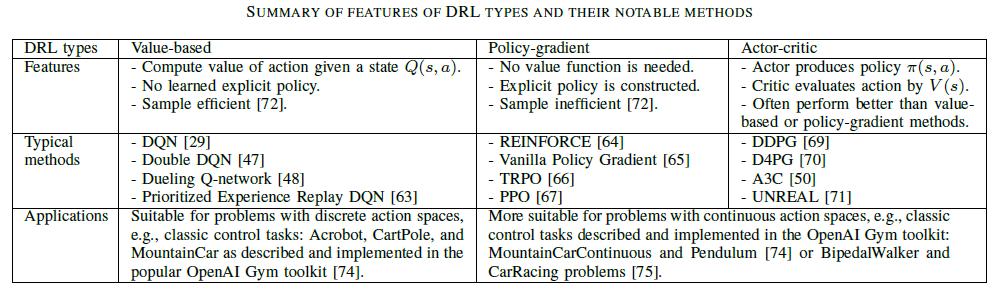

### High-level idea

<!--more-->

- Given a state $s$, the reward $r$ is a function that can tell the agent how good or bad an action $a$ is.
- Based on received rewards, the agent learns to take more good actions and gradually filter out bad actions.

### Categorization of methods

- Value-based method: evaluate the goodness of an action given a state using the Q-value function.
  - inefficient/impractical when the number of states or actions is large or infinite.
- Policy-gradient method: derive actions directly by learning a **policy $\pi(s,a)$ that is a probability distribution over all possible actions**.
  - suffer from a large fluctuation.
- Actor-critic method (combination of value-based and policy-gradient methods): the actor attempts to learn a policy by receiving feedback from the critic.
  - critic-value loss function: $L_1=\sum(R-V(s))^2$, where the discount future reward $R=r+\gamma V(s^\prime)$
    - $\gamma \in [0,1]$ is the discount factor that manages the importance levels of future rewards.
    - $V(s)$ represents the expected (scalar) reward of a given state 
  - actor-policy loss function: $L_2=-log(\pi(a \vert s)) * A(s) - \theta H(\pi)$, where the estimated advantage function $A(s)=R-V(s)$
    - $H(\pi)$ is the entropy term controlled by the hyperparameter $\theta$.
    - $A(s)$ shows how advantageous the agent is when it is in a particular state.

<figure><figcaption>cited from "Deep Reinforcement Learning for Cyber Security"</figcaption></figure>